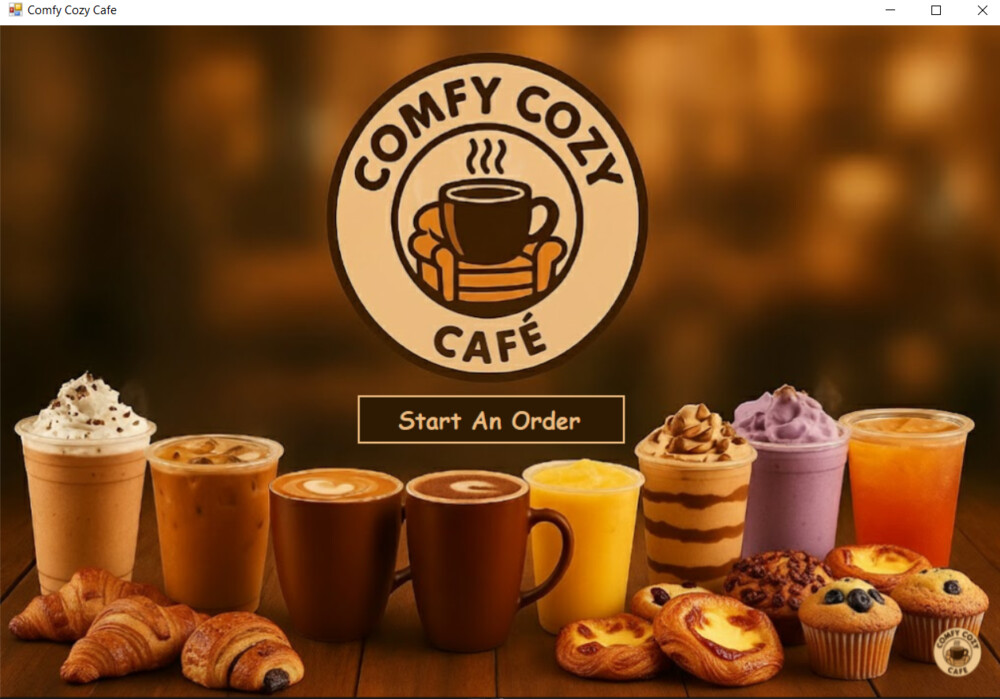
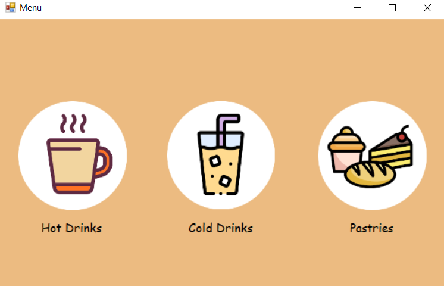
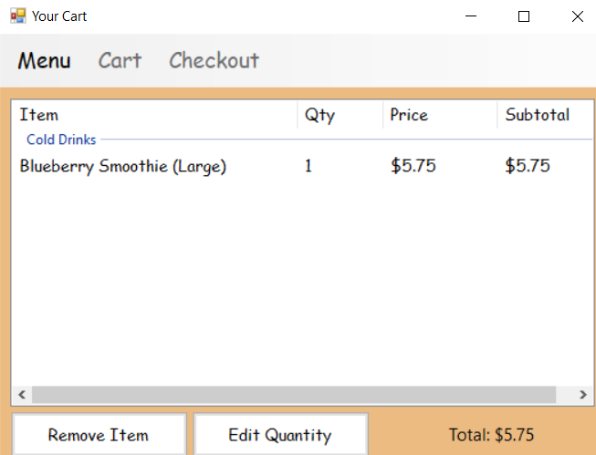
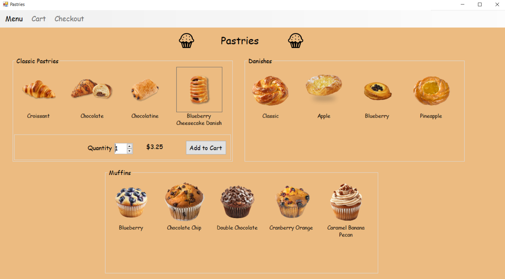
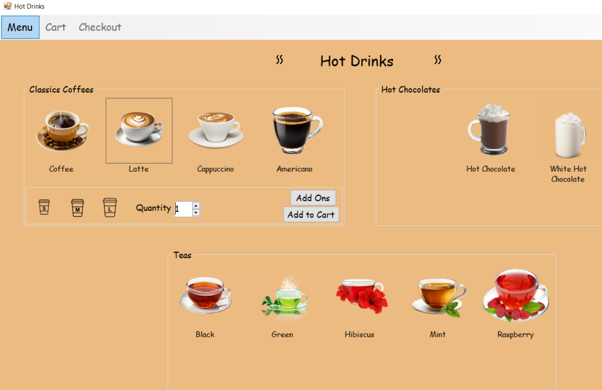
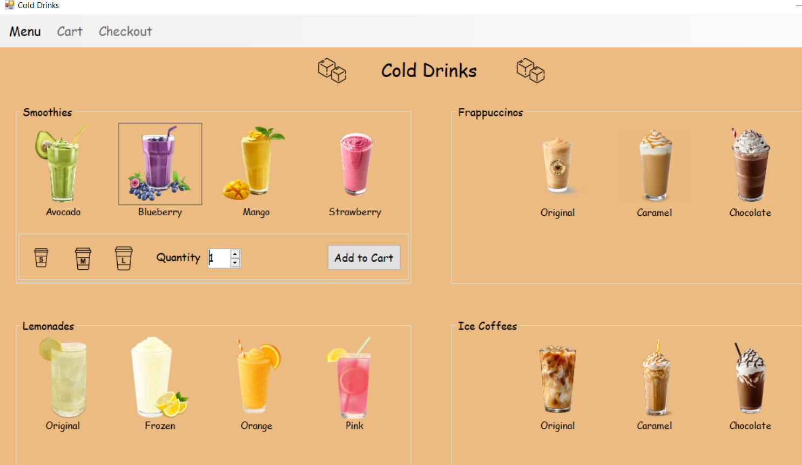

# Comfy Cozy Cafe ☕

A C# Windows Forms café-ordering application that lets customers browse drinks and pastries, customize items, manage a shopping cart, and move through a visual ordering experience.

## Screenshots

  
   
  <b>Welcome Screen</b>

<table>
  <tr>
    <td align="center"> <b>Category Menu</b></td>
    <td align="center"> <b>Shopping Cart</b></td>
  </tr>
  <tr>
    <td align="center"> <b>Pastries Menu</b></td>
    <td align="center"> <b>Hot Drinks Menu</b></td>
  </tr>
  <tr>
    <td colspan="2" align="center"> <b>Cold Drinks Menu</b></td>
  </tr>
</table>

## Quick Start

HOW I START: DOWNLOAD ZIP FILE, DOUBLE CLICK ON .SLN FILE, OPENS ANDROID STUDIO, RUN

This project runs on Windows and targets **.NET Framework 4.7.2**.

1. Download and extract the repository.
2. Install Visual Studio 2022 with the **.NET desktop development** workload.
3. Double-click `run.bat`.

The launcher builds the solution and opens the application automatically. If Visual Studio Build Tools are not found, it opens the solution in Visual Studio for you.

## Features

- Start-up and main café menus
- Hot drinks, cold drinks, smoothies, teas, and pastries
- Product images and visual category navigation
- Size, quantity, milk, cream, sugar, and add-on selections
- Shopping-cart management and calculated totals
- Multiple connected Windows Forms
- Embedded image resources

## Technologies and Concepts

- C#
- Windows Forms
- .NET Framework 4.7.2
- Visual Studio 2022
- Event-driven programming
- Object-oriented programming
- Resource management
- Multi-project solution architecture

## Project Structure

- `Comfy Cozy Cafe/` – start-up and main navigation forms
- `MenuSetup/` – shared category-navigation interface
- `Menus/` – products, customizations, quantities, and cart
- `Comfy Cozy Cafe.sln` – complete Visual Studio solution
- `run.bat` – Windows quick-start launcher

## Manual Run

1. Open `Comfy Cozy Cafe.sln` in Visual Studio.
2. Build the solution.
3. Set **Comfy Cozy Cafe** as the startup project if necessary.
4. Press **F5** or select **Start**.

## What I Practiced

This academic project strengthened my skills in C# desktop development, event handlers, form navigation, cart logic, reusable controls, visual resource integration, and organizing a multi-project solution.
